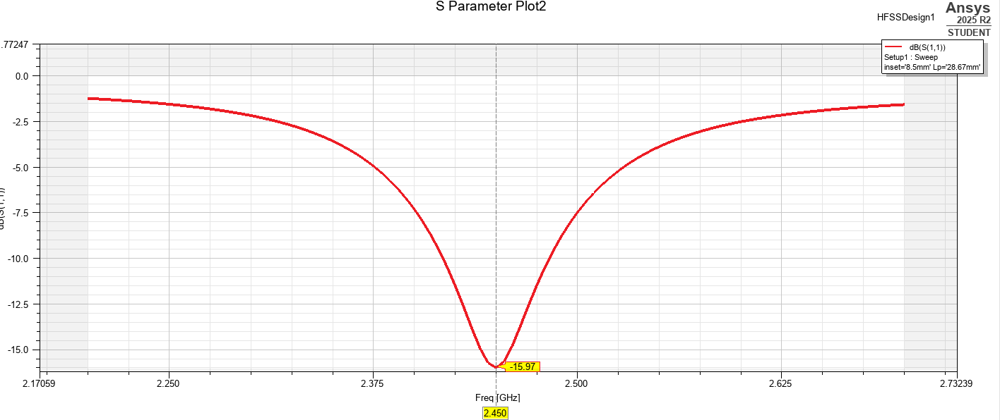
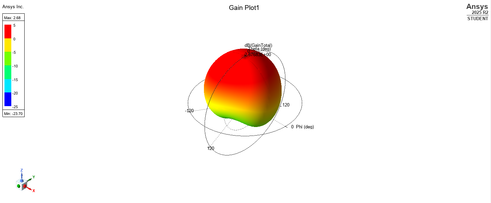
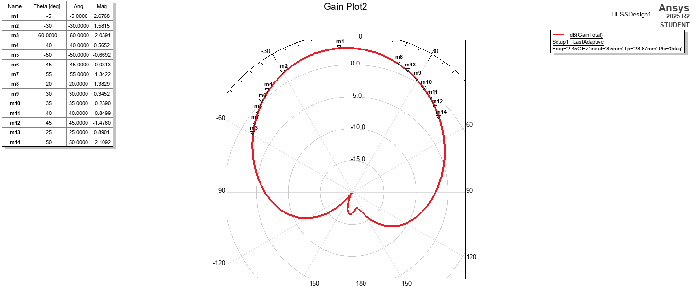
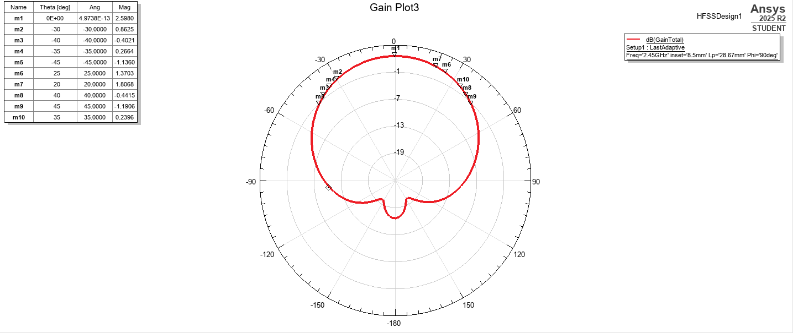
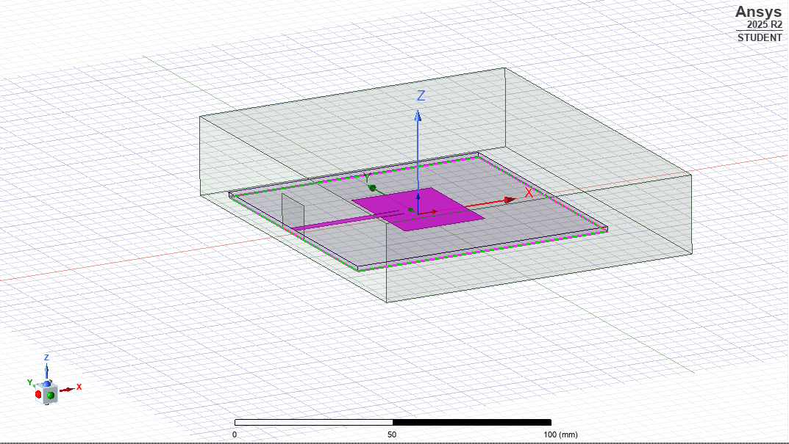

# Microstrip Patch Antenna @ 2.45 GHz

## Student Information
Name: Thanate Thongcharoen  
Student ID: 6610610120  
Course: LE312  

---

## Project Overview

This project presents the design and simulation of a rectangular microstrip patch antenna operating at 2.45 GHz using Ansys HFSS.

The antenna performance was analyzed in terms of:
- S11 (Return Loss)
- 3D Realized Gain
- 2D Radiation Pattern (Phi = 0° and 90°)
- Half Power Beamwidth (HPBW)

---

## Design Parameters

- Frequency: 2.45 GHz  
- Dielectric constant (εr): 4.4  
- Substrate thickness: 1.6 mm  
- Patch Width (Wp): 37.3 mm  
- Patch Length (Lp): 28.67 mm  
- Feed Width (Wf): 3.1 mm  
- Inset: 8.5 mm  

---

## Simulation Results

### S11
S11 @ 2.45 GHz = -15.97 dB  

---

### 3D Realized Gain
Peak Gain = 2.598 dBi  

---

### HPBW
Maximum Gain = 2.598 dBi  
Half Power Level = -0.402 dBi  
HPBW ≈ 80°  

---

## Software Used
Ansys HFSS 2025 R2 (Student Version)
---

## Simulation Figures

### S11 Result

### 3D Radiation Pattern

### 2D Radiation Pattern (Phi = 0°)

### 2D Radiation Pattern (Phi = 90°)

### 3D Antenna Model

